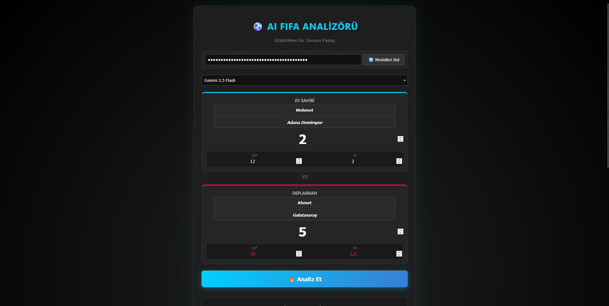

# ⚽ AI FIFA Analizörü (AI FIFA Oracle)


FIFA maçlarınızın sonuçlarını, istatistiklerini (xG, Şut) ve seçilen takımları analiz ederek kazananı öven, kaybedeni "toksik" bir dille yerin dibine sokan yapay zeka destekli web uygulaması.

Arkadaşlarınızla oynadığınız maçlardan sonra "Kol bozuktu", "Script yedik" bahanelerini yapay zeka yorumlasın!



## 🌟 Özellikler

* **🧠 Google Gemini Entegrasyonu:** Maç verilerini analiz eder ve her seferinde benzersiz, mizahi ve iğneleyici yorumlar üretir.
* **📊 Detaylı İstatistik Analizi:** Sadece skora değil; **xG (Gol Beklentisi)** ve **Şut Sayısı** verilerine bakarak oynanışı eleştirir. (Örn: "20 şut çekip gol atamadıysan sorun kolda değil sendedir.")
* **👕 Takım Bazlı Yorumlar:** Seçilen takımların gücüne göre (Real Madrid vs Pendikspor) yorum yapar.
* **📸 Sonuç Kartı Oluşturucu:** Analiz sonucunu şık bir tasarımda `.png` formatında indirip WhatsApp veya Instagram'da paylaşmanızı sağlar.
* **🔄 Dinamik Model Seçimi:** API anahtarınızla uyumlu Gemini modellerini otomatik listeler.
* **🎨 Neon UI Tasarım:** Oyuncu atmosferine uygun karanlık ve neon renkli arayüz.

## 🚀 Kurulum ve Kullanım

Bu proje herhangi bir sunucu kurulumu veya `npm install` gerektirmez. Doğrudan tarayıcıda çalışır.

1.  Bu repoyu bilgisayarınıza indirin (Clone) veya ZIP olarak indirin.
    ```bash
    git clone https://github.com/ACRZeuss/ai-fifa-analizoru.git
    ```
2.  Klasörün içindeki `index.html` dosyasını tarayıcınızda (Chrome, Edge, Firefox vb.) açın.
3.  **Google Gemini API Anahtarı** edinin: [Google AI Studio](https://aistudio.google.com/app/apikey) adresinden ücretsiz alabilirsiniz.
4.  Uygulamaya API anahtarınızı girin, maç skorlarını yazın ve **"🔥 Analiz Et"** butonuna basın!

## ⚠️ Önemli Güvenlik Notu

* Uygulama tamamen **Client-Side (Tarayıcı Taraflı)** çalışır.
* Girdiğiniz API Anahtarı **hiçbir yere kaydedilmez**, sunucuya gönderilmez. Sadece tarayıcınızdan Google sunucularına istek atmak için kullanılır.
* Sayfayı yenilediğinizde anahtar silinir.

## 🛠️ Kullanılan Teknolojiler

* **HTML5 & CSS3:** Modern ve Responsive Tasarım.
* **Vanilla JavaScript:** Mantık ve API iletişimi.
* **Google Gemini API:** Metin üretimi ve yapay zeka yorumları.
* **html2canvas:** Sonuç ekranını resim olarak indirmek için.

## 🤝 Katkıda Bulunma

1.  Bu projeyi Forklayın.
2.  Yeni bir özellik dalı (branch) oluşturun (`git checkout -b yeni-ozellik`).
3.  Değişikliklerinizi yapın ve Commit'leyin (`git commit -m 'Yeni özellik eklendi'`).
4.  Branch'inizi Pushlayın (`git push origin yeni-ozellik`).
5.  Bir Pull Request oluşturun.

## 👨‍💻 Geliştirici

**Erhan Polat**
* GitHub: [@Erhan Polat](https://github.com/ACRZeuss)
* Buy me a coffee": [@Erhan Polat](https://buymeacoffee.com/erhanpolat)

---
*Bu proje eğlence amaçlı yapılmıştır. FIFA, EA Sports'un ticari markasıdır.*